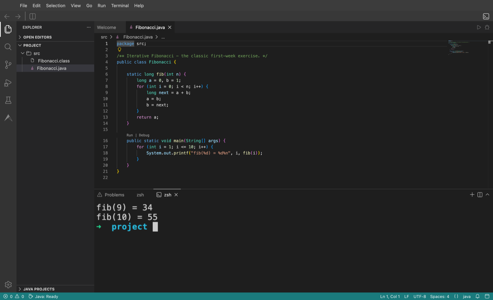
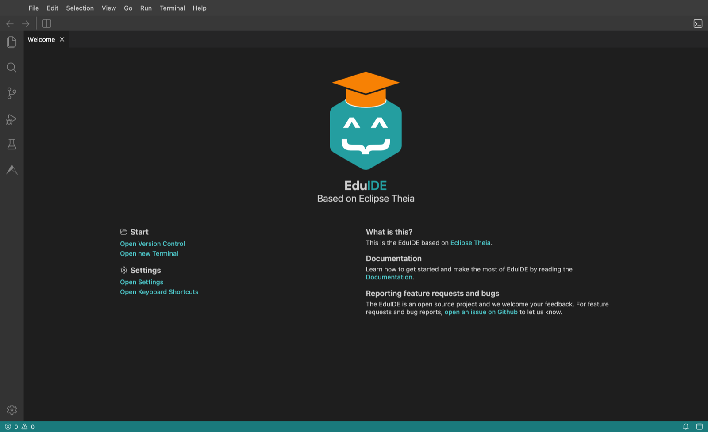

<div align="center">
    
    <h1>EduIDE</h1>
    <p><strong>A full IDE in the browser, pre-configured for the course a student is actually taking.</strong></p>
</div>

---

Students open a link and get a real IDE - compiler, language server, debugger,
terminal, linting and editor settings already set up for their language. Nothing
to install, nothing to configure, and every student gets the identical
environment, so "it works on my machine" stops being a thing anyone has to
debug.

Instructors pick the matching image when creating a programming exercise in
[Artemis](https://github.com/ls1intum/Artemis). EduIDE does the rest.

It is built on [Eclipse Theia](https://theia-ide.org/), and it is a real IDE
rather than a text box in a web page:

<div align="center">
  
</div>

<div align="center">
  
</div>

## Try it in one command

Any published image runs standalone. No Kubernetes, no Artemis, no account:

```sh
docker run --rm -p 3000:3000 ghcr.io/eduide/eduide/java-17:latest
```

Open <http://127.0.0.1:3000/>. The screenshot above is that container.

Swap `java-17` for any of these:

| | Image | | Image |
| --- | --- | --- | --- |
| Java 17 | `java-17` | Python | `python` |
| Java 25 | `java-25` | Rust | `rust` |
| C | `c` | OCaml | `ocaml` |
| JavaScript | `javascript` | Haskell | `haskell` |

Three `-templates` variants (`java-17-templates`, `java-25-templates`,
`c-templates`) ship a starter project and are what Artemis exercises usually
use. All images are published to `ghcr.io/eduide/eduide/<name>`.

A course-specific variant, `thm-java-25`, mirrors the TH-Mannheim PR2 course
setup: OpenJDK 25 and Maven, without the Artemis/EduIDE extensions.

## Documentation

| | |
| --- | --- |
| [Documentation site](https://eduide.github.io/Docs/) | Everything, start here |
| [Running EduIDE for your university](https://eduide.github.io/Docs/admins/intro) | Installing it on a Kubernetes cluster |
| [Developer guide](https://eduide.github.io/Docs/developer/intro) | Architecture and how the pieces fit |
| [Building an IDE variant](docs/how-to-build-ide-variants.md) | Adding a language, in detail |

## How it fits together

This repository is the IDE and the images. Running it as a service for a whole
university takes three more:

| Repository | |
| --- | --- |
| **EduIDE** (here) | The Theia-based IDE and every language image |
| [EduIDE-Cloud](https://github.com/EduIDE/EduIDE-Cloud) | The operator and REST service that start and stop sessions |
| [EduIDE-Landing-Page](https://github.com/EduIDE/EduIDE-Landing-Page) | Where students pick an environment |
| [EduIDE-Helm](https://github.com/EduIDE/EduIDE-Helm) | The Helm charts that install all of it |

Every image is a **two-tier build**: `base-ide` compiles Theia from source once,
and each language image starts from that layer and adds its toolchain and its
VS Code extensions from [Open VSX](https://open-vsx.org/). Adding a language
never rebuilds the IDE.

## Contributing

Contributions are welcome, including from outside TUM.

Build and run everything locally with Docker Compose. The base image builds
first; language images pick it up automatically:

```sh
docker compose -f docker-compose.images.yml build java-17
docker compose -f docker-compose.images.yml up java-17     # http://127.0.0.1:3003/
```

Each language has a host port; see `docker-compose.images.yml`.

**Adding a language** takes four things: `images/<lang>/ToolDockerfile`, a
`package.json.patch` listing only the plugin overrides, a service in
`docker-compose.images.yml`, and a matrix entry in
`.github/workflows/build.yml`. Copy `images/java-17` as the starting point -
[the full walkthrough is here](docs/how-to-build-ide-variants.md).

Building an image does not offer it to anyone. It also needs an entry in
`appDefinitions.apps` in the `eduide` chart in
[EduIDE-Helm](https://github.com/EduIDE/EduIDE-Helm), which is what puts it on
the landing page and preloads it onto the cluster's nodes.

**Updating Theia** touches every `@theia/*` package at once:

```sh
yarn update:theia 1.69.0
```

CI builds `base-ide` first and threads its immutable tag into every language
build, so a pull request can never test against a base image that has since
moved. PRs publish `pr-<number>` tags you can pull and try.

## License

[MIT](LICENSE). "Theia" is a trademark of the Eclipse Foundation -
<https://www.eclipse.org/theia>.

This project is a fork of [Eclipse Theia IDE](https://github.com/eclipse-theia/theia-ide),
tailored for computer science education.
